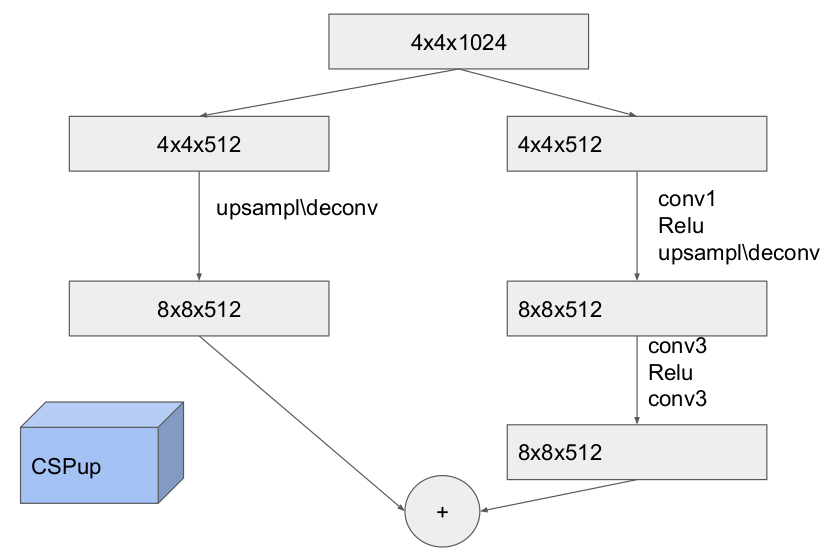
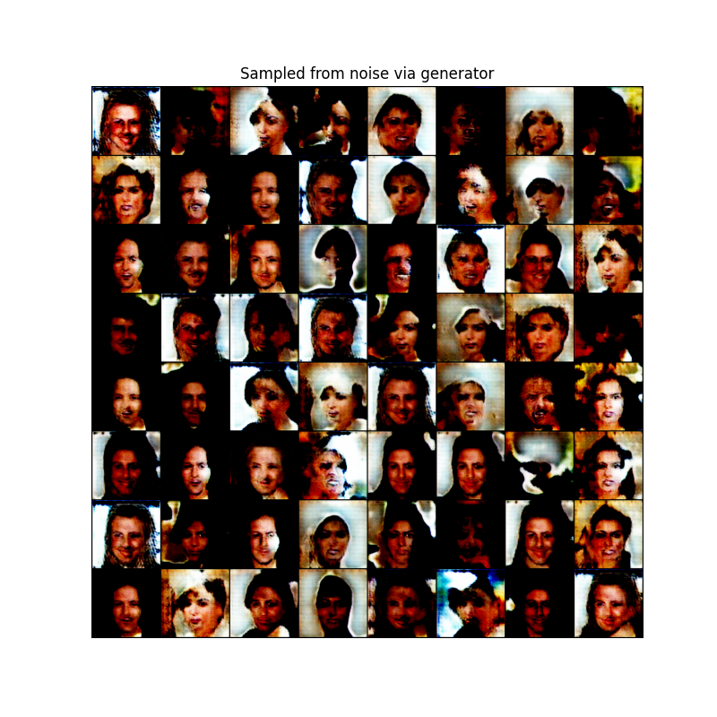

# GAN Training

In this work the goal is to effectively train DCGAN implementation using so-called CSPup blocks. Structure of those could be seen below.

## Results

The fight for convergeance isn't over yet. The best result so far could be seen below. That was achieved with standard loss and RLC regularization.

The detailed comparison of different configurations (consists of adversarial loss type and regularization type) would be added later.
