# Subject-Driven Generation

DreamBooth is a method to personalize text2image models like stable diffusion given just a few images of a subject. I used 14 different images of me (guy Daniel Moore) with different angles (/src) and tried some prompts. Here's what I got.

## Results

### Prompt 1: Daniel Moore as a human fighter in the style of a baldurs gate character portrait

| | | | |
|:-------------------------:|:-------------------------:|:-------------------------:|:-------------------------:|
| Guidance scale: 7| Guidance scale: 7| Guidance scale: 7| Guidance scale: 7|
| Guidance scale: 7| Guidance scale: 4| Guidance scale: 4| Guidance scale: 4|

### Prompt 2: Highly detailed portrait of Daniel Moore, sunglasses, blue eyes, tartan scarf, white hair by atey ghailan, by greg rutkowski, by greg tocchini, by james gilleard, by joe fenton, by kaethe butcher, gradient yellow, black, brown and magenta color scheme, grunge aesthetic!!! graffiti tag wall background

| | | | |
|:-------------------------:|:-------------------------:|:-------------------------:|:-------------------------:|
| Guidance scale: 7| Guidance scale: 7| Guidance scale: 4| Guidance scale: 4|
| Guidance scale: 9| Guidance scale: 9| Guidance scale: 9| Guidance scale: 9|

This prompt was the most stable in the sense of generating good images of me.

### Prompt 3: Daniel Moore, on a vintage 90's anime style; by hajime sorayama, greg tocchini, virgil finlay, sci-fi, colors, neon lights. line art

| | | | |
|:-------------------------:|:-------------------------:|:-------------------------:|:-------------------------:|
| Guidance scale: 7| Guidance scale: 7|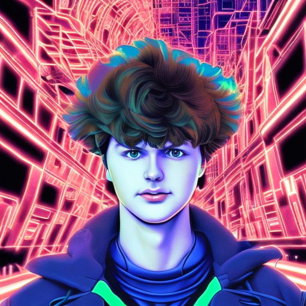 Guidance scale: 7|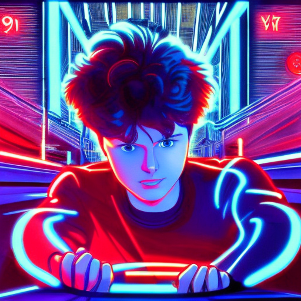 Guidance scale: 7|
| Guidance scale: 4| Guidance scale: 4| Guidance scale: 4| Guidance scale: 4|

### Prompt 4: Daniel Moore in stylish haute couture outfit in the style of 90's vintage anime, surrealism, akira style. detailed line art. fine details. inside a space ship

| | | | |
|:-------------------------:|:-------------------------:|:-------------------------:|:-------------------------:|
| Guidance scale: 7| Guidance scale: 7|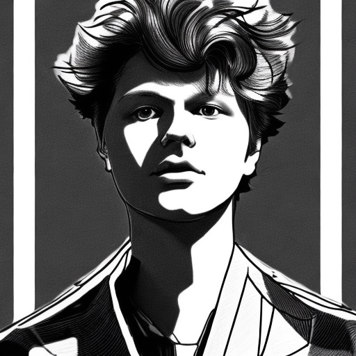 Guidance scale: 7|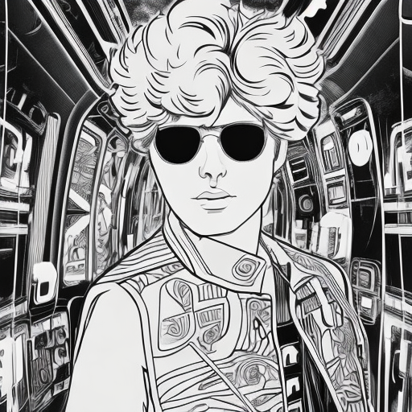 Guidance scale: 7|
|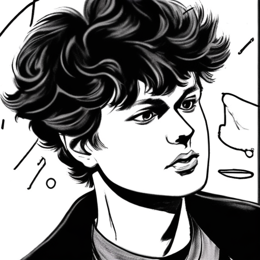 Guidance scale: 7|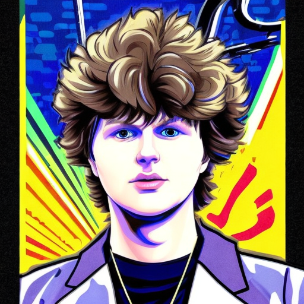 Guidance scale: 7| Guidance scale: 4| Guidance scale: 9|

### Prompt 5: Perfect portrait of Daniel Moore, new york, medium format, fuji superia 400, iso 400, cinematic, photorealistic, surrealistic, details, 8k

| | | | |
|:-------------------------:|:-------------------------:|:-------------------------:|:-------------------------:|
| Guidance scale: 7| Guidance scale: 7| Guidance scale: 7|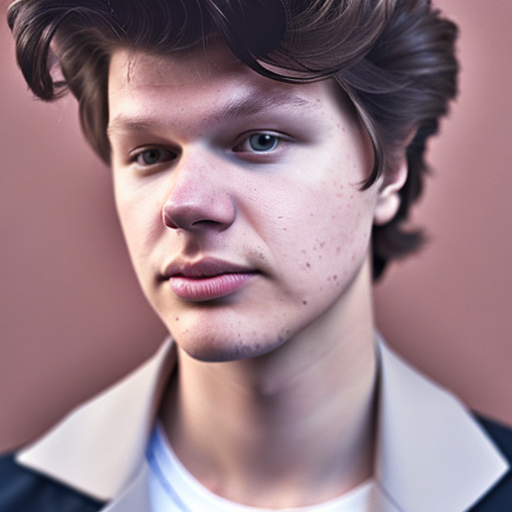 Guidance scale: 7|
|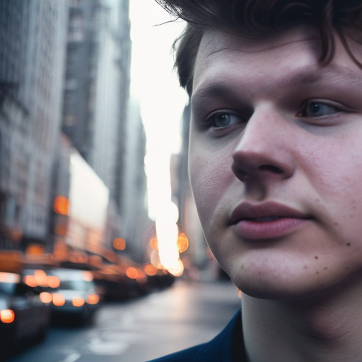 Guidance scale: 7|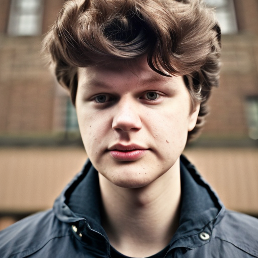 Guidance scale: 7|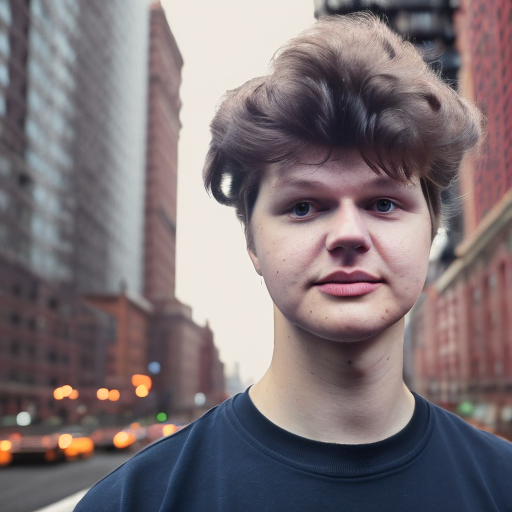 Guidance scale: 7|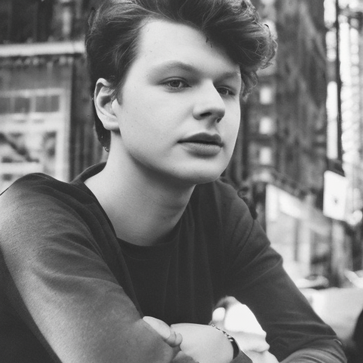 Guidance scale: 7|

This prompt did a great work in the sense of photography quality and generation of great New York landscapes but my face is totally ruined. It's probably because of poor quality source images as there's huge "face variance". It seems that result would be much better if all images were provided from one photo session.

### Prompt 6: A portrait of Daniel Moore viking runing muscular, smoking a cigar, gorgeous, intricate, elegant, volumetric lighting, scenery, high detail digital art, smooth, tony sart, lucian freud, anato finnstark, randy vargas, diego gisbert llorens, johan grenier, ruan jia, steve mccurry, photorealistic lighting, sharp focus, illustration

| | | | |
|:-------------------------:|:-------------------------:|:-------------------------:|:-------------------------:|
| Guidance scale: 7| Guidance scale: 7|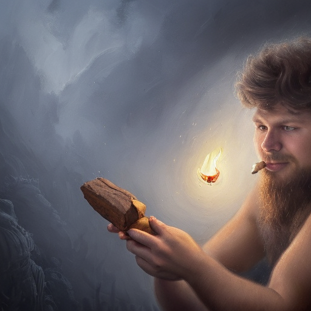 Guidance scale: 7|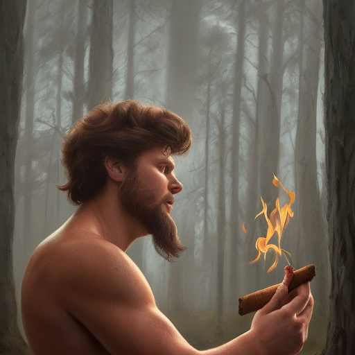 Guidance scale: 7|
|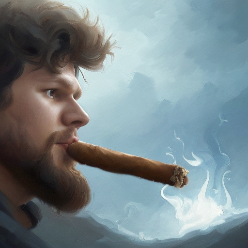 Guidance scale: 7|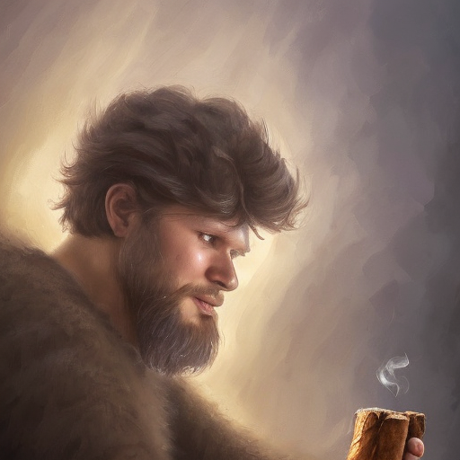 Guidance scale: 7|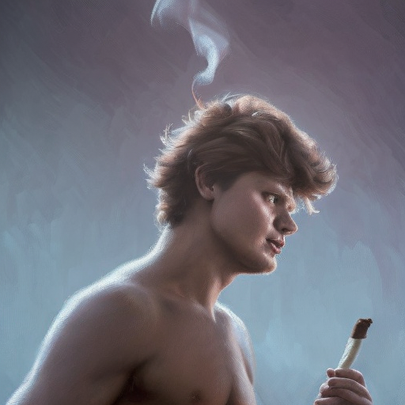 Guidance scale: 7|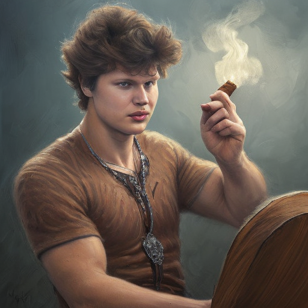 Guidance scale: 7|

### Prompt 7: Daniel Moore is programming at a computer in a room full of gadgets, by makoto shinkai and ghibli studio, outlined silhouettes, dramatic lighting, highly detailed, incredible quality, trending on artstation

| | | | |
|:-------------------------:|:-------------------------:|:-------------------------:|:-------------------------:|
| Guidance scale: 7| Guidance scale: 7| Guidance scale: 7| Guidance scale: 7|
| Guidance scale: 7| Guidance scale: 4| Guidance scale: 4| Guidance scale: 9|

### Prompt 8: Daniel Moore wearing cyberpunk intricate streetwear, respirator, beautiful, detailed portrait, cell shaded, 4 k, vivid colours, concept art, by wlop, ilya kuvshinov, artgerm, krenz cushart, greg rutkowski, pixiv. cinematic dramatic atmosphere, sharp focus, volumetric lighting, cinematic lighting, studio quality

| | | | |
|:-------------------------:|:-------------------------:|:-------------------------:|:-------------------------:|
| Guidance scale: 7| Guidance scale: 7|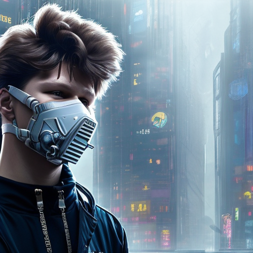 Guidance scale: 7| Guidance scale: 4|
| Guidance scale: 4| Guidance scale: 4| Guidance scale: 9| Guidance scale: 9|
